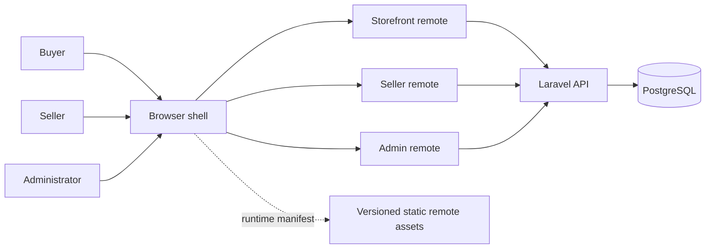

# Architecture

Status: selected topology; detailed contracts proposed. No code or infrastructure exists yet.

## System context



Use one repository for the new project, with frontend workspaces and a backend subtree. Backend monorepo means co-located code, not separate services.

## Proposed future layout

```text
frontend/
  apps/ shell/ storefront/ seller/ admin/
  packages/ design-tokens/ ui/ contracts/ api-client/
backend/
  apps/api/                       # Laravel deployment
    app/Modules/
      Identity/ Sellers/ Catalog/ Inventory/
      Checkout/ Orders/ Administration/
docs/
```

Use pnpm workspaces for JavaScript; Composer for Laravel. Shared backend modules are namespaced within Laravel rather than pretending they are independent deployments. Pin compatible supported releases and commit lockfiles during scaffolding; no version has been installed or verified here.

## Runtime boundaries

| Owner | Routes / responsibility | Exposed capability |
| --- | --- | --- |
| Shell | Top-level routing, sign-in, safe return path, session integration, remote loading and failure | Host services contract |
| Storefront | /, /products, /products/:slug, /cart, /checkout, /orders, /orders/:id | Route tree mounted below shell |
| Seller | /seller/* | Seller route tree |
| Admin | /admin/* | Administrator route tree |
| Shared packages | Tokens, accessible primitives, API types/utilities | Versioned build-time packages |
| Laravel | Session, ownership, price authority, transactions and audit | JSON API |

Each remote exports `./routes` and metadata including `contractMajor: 1`; it owns its nested routes. Shell fetches a runtime-controlled deployment manifest with artifact URL and contract major. It checks metadata before mounting and handles import failures. No checkout state crosses seller/admin remotes.

Host services v1: current session reader, session-change subscription, safe internal navigate, configured API client. Do not pass credentials to remotes or use localStorage bearer tokens. Shared React/React DOM must be compatible singletons; navigation types are versioned. Build-time shared UI changes require rebuilding consumers intentionally, not hidden runtime mutation.

Backend is the cart/order authority. Frontend cache is scoped by signed-in user, cleared on logout, and revalidated on session change. Storefront preserves checkout inputs in session memory within its workflow; never serialize passwords/card data or sensitive addresses into URLs.

## Failure and releases

- Configurable remote-load timeout, proposed 10 seconds; fail to a shell-owned recovery view.
- Retry reattempts loading without a reload loop; back/catalog links remain available.
- A remote error boundary protects the shell. On checkout uncertainty, reconcile the attempt key before allowing another submission.
- Independent CI builds immutable artifacts per remote; deployment manifest selects versions.
- Rollback changes manifest selection, not shell code. Keep old versioned artifacts until cache windows expire.
- Contract major mismatch blocks mount with a useful recovery screen; log diagnostics outside user-facing copy.
- API changes are additive within /api/v1; breaking changes require a new version and compatibility plan.
- Health, request IDs, remote load/version/error telemetry and transaction failure codes support the demo.

First-party sessions use a single browser origin and an API reverse proxy. Static remote origins need narrow CORS where required; dynamic scripts must come only from allowlisted asset origins. Laravel policies protect all records even when UI navigation is hidden. [Sanctum SPA guidance](https://laravel.com/framework/docs/13.x/sanctum)

## Proposed NFRs and demonstration evidence

No production SLA is claimed. Record device/network/dataset for measurements. Targets from the brief are provisional. Demonstrate one independently released remote, one rollback, one unavailable remote, deep links, shared session and rejected cross-seller requests.

The chosen Vite integration documents dependency sharing and remote modules; current limitations must be checked during the integration spike rather than assuming development hot reload works across all remotes. [Official integration](https://module-federation.io/integrations/build-tool/vite)

## Budget constraint

CON-05 requires zero additional monetary spending. Repository layout and independent frontend releases remain unchanged. Local full-stack execution is the proposed baseline; free static frontend hosting and persistent public Laravel/database hosting are separate feasibility decisions. The selected session/proxy model must be supported without purchasing a domain. See [zero-cost hosting](hosting-zero-cost.md).
