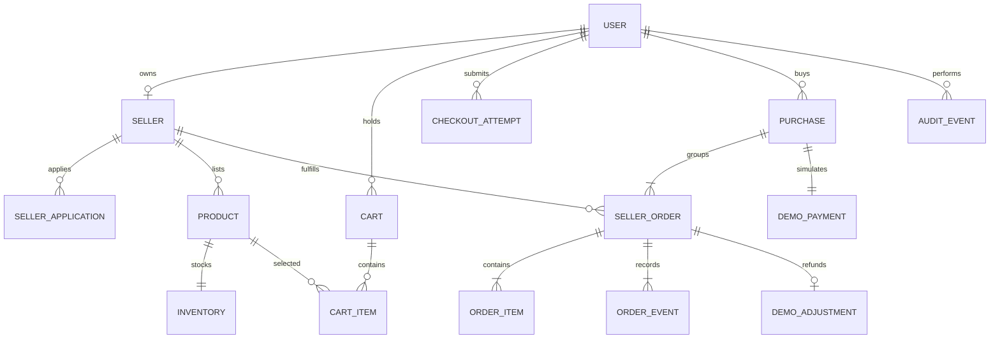

# Data outline

Proposed PostgreSQL relational model; not migrations and not an exhaustive per-column schema. Types/limits will be finalized when generating implementation contracts.

| ID | Tables / essential fields | Integrity and access |
| --- | --- | --- |
| DB-01 | users: id, name, email, password_hash, role; framework sessions | Unique email; confidential credentials never serialized |
| DB-02 | sellers: id, owner_user_id, name, approval status; seller_applications: state, review reason, reviewer/version | Owner FK; admin-only review; rejection reason required |
| DB-03 | products: seller/category, title/slug, description, image refs, material/dimensions, price_centavos, visibility, moderation flag/version | Unique slug; nonnegative price; seller-scoped; archived visibility instead of destructive deletion |
| DB-04 | inventory: product_id, available_quantity, version | Unique product; quantity ≥ 0; locked allocation/versioned edit |
| DB-05 | carts/cart_items: buyer, version, product, quantity | Unique cart/product line; positive quantity; totals derived server-side |
| DB-06 | checkout_attempts: buyer, key, request_hash, state, result reference/failure code | Unique buyer/key; serializes replay; do not log/store raw credentials |
| DB-07 | purchases/seller_orders/order_items: buyer/seller, item and delivery snapshots, currency, totals/status/version | One seller order per seller/purchase; immutable price/title snapshots; quantity > 0 |
| DB-08 | demo_payments/demo_adjustments: purchase/order, status, amount_centavos | One payment/purchase and at most one cancellation adjustment/order |
| DB-09 | order_events/audit_events: entity, actor, action, previous/new state, timestamp | Append-only application behavior; do not place full addresses or passwords in audit payload |

Add created_at/updated_at consistently; timestamps stored UTC and displayed in Asia/Manila. Order events record actor and state. Financial/demo totals are integer centavos; records explicitly identify them as simulated.

FK deletion defaults: RESTRICT for purchased products, sellers, buyers and order entities; CASCADE only for unpurchased cart lines. Public listing visibility uses archive/moderation status. Do not cascade-delete historic orders when a catalog item changes.

Address snapshot is confidential, visible only to its buyer, owning seller for fulfillment, and authorized admin inspection. Public products are public; supplier contact/application details are confidential; stock and audit are internal. Demo records use fictional addresses.

Indexes support: product visibility/category/price browsing; seller product lists; buyer purchase chronology; seller order state/date; pending applications; idempotency uniqueness. Add further indexes only for measured queries.

Prototype fixture dataset: at least two sellers, one pending applicant and twelve goods across three categories. Purchase CM-1001 below is the canonical design example.

Retention/reset schedule is unresolved for hosting. Until then, local fixtures reset manually. Never claim a right-to-erasure or statutory retention policy has been verified.
