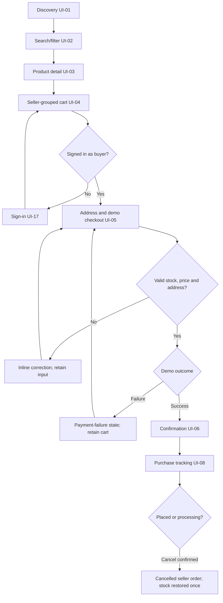

# User flows

Status: flows translated into editable Pencil desktop/mobile frames. Transitions are annotated; no application behavior is implemented.

## UF-01: Buyer purchase (US-01–US-04)

Goal: select suitable goods, understand each seller's costs and complete a demo order.

Starting point: discovery or a deep-linked product. Search and filters are preserved on return. Sign-in returns to the cart rather than losing progress. No forced account signup, card entry, optional marketing fields or hidden shipping charges.

Checkout has visible labels, address fields, seller summaries and one primary action: Place demo order. Outcome selection is labeled Demo payment result with success/failure choices. On a network-unknown result, reconcile the existing attempt before creating another.

Success: purchase summary plus separate seller delivery panels. Errors: empty results, offline request, unavailable product, insufficient stock, changed price, invalid address, session expiry and demo payment failure. Each has a recovery action.

## UF-02: Seller product maintenance (US-05)

Inventory UI-11 → Add/edit product UI-12 → validate → Save draft → inspect inventory → Publish. Product editor uses the same product attributes displayed to buyers.

Fields: title, category, price, stock, materials, dimensions, description and seeded image reference. Stock is edited with version checking. A stale update shows the current value and preserves the proposed edit; no silent overwrite. Moderation restrictions are explained near the publishing action.

Success: saved/published status appears in the product row. Failure: field errors or save conflict. Keep draft content and return to the previous filtered inventory list.

## UF-03: Seller fulfillment (US-06)

Order queue UI-09 → Seller order UI-10 → Start processing → Mark shipped → Mark delivered (demo). Show buyer delivery snapshot only within the authorized order.

The current state determines the next action. Shipping and cancellation cannot both win a concurrent race. Shipment needs confirmation that the seller intends to dispatch; no real carrier tracking is implied.

Cancelled orders become read-only; no action can restore them to processing. Delivery action is clearly labeled as manual/demo.

## UF-04: Admin seller review (US-07)

Approval queue UI-13 → Application UI-14 → inspect shop/contact information → Approve or Reject with reason → return to queue. Decisions display actor/time. A stale decision prompts refresh instead of silently applying.

## UF-05: Admin listing/order oversight (US-08)

Moderation UI-15 → inspect listing → unpublish/clear restriction with reason → audit result. Order oversight UI-16 → filter purchase → expand seller orders → inspect their statuses, totals and events. Admin inspection does not introduce fulfillment shortcuts.

## UF-06: Session and remote recovery (US-09)

Shell routes to sign-in UI-17 when required. Return targets are restricted to internal paths. Remote load/import/compatibility failure renders UI-18 within the shell with Retry and a safe navigation link. Preserve unrelated shell state and avoid blaming the user.

## Demo fixture shared across screens

Purchase CM-1001 belongs to Alex Rivera, fictional address: 24 Sample Lane, Demo District, Quezon City 1100.

| Seller / SKU | Quantity | Unit price | Line total |
| --- | --- | --- | --- |
| Kubo Living / Stoneware mug, oat | 2 | PHP 450.00 | PHP 900.00 |
| Kubo Living / Cotton hand towel | 1 | PHP 320.00 | PHP 320.00 |
| Daily Objects / Desk tray, walnut | 1 | PHP 790.00 | PHP 790.00 |

Kubo item subtotal PHP 1,220.00 + delivery PHP 80.00 = PHP 1,300.00. Daily Objects subtotal PHP 790.00 + delivery PHP 80.00 = PHP 870.00. Purchase items PHP 2,010.00 + delivery PHP 160.00 = **PHP 2,170.00**.

Cart/checkout/confirmation/tracking/seller/admin screenshots must use these same numbers. Separate catalog products may use other prices. Later lifecycle frames can show one order shipped and another processing; confirmation initially shows both placed.
