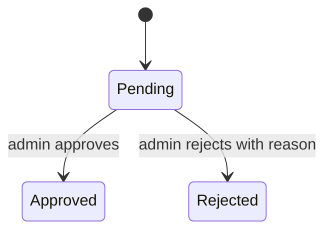
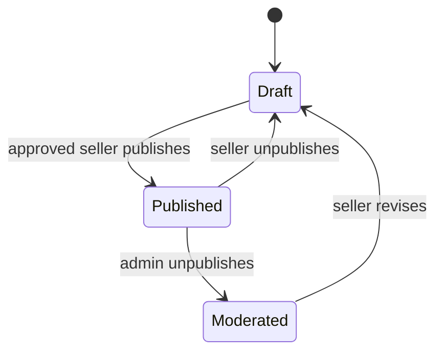
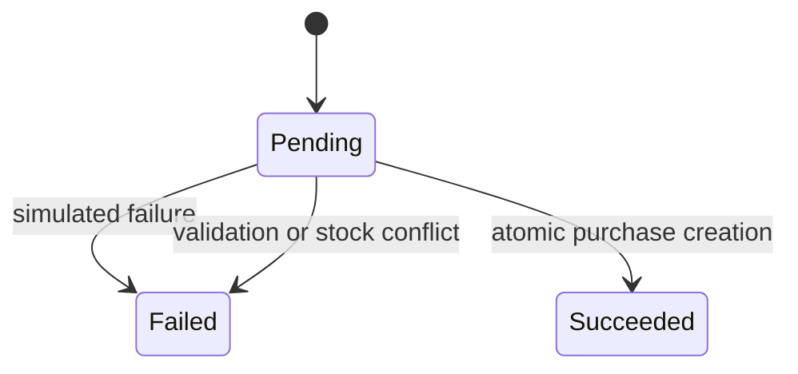
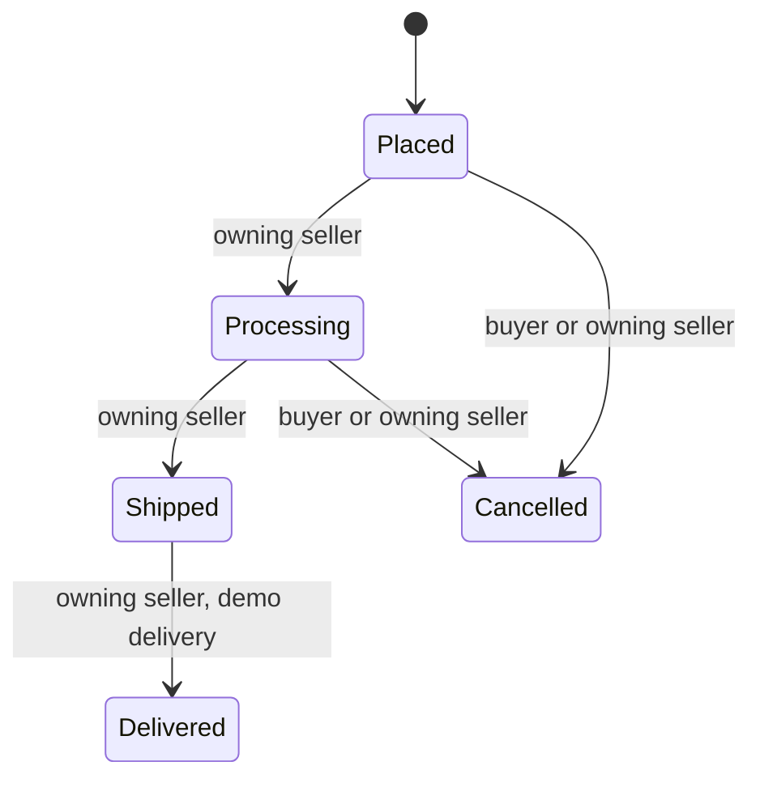

# State models

All transitions below are proposed v1 contracts. Centralize transitions in the owning Laravel module. Lock the affected order/stock rows and write audit events within the same transaction. Side effects visible to other systems run after commit. An invalid transition returns 409 with a stable code.

## Seller application

| From → to | Actor / condition | Effects | Failure |
| --- | --- | --- | --- |
| Pending → Approved | Admin; current version matches | Enable seller publishing; audit | 403 unauthorized; 409 stale decision |
| Pending → Rejected | Admin; reason provided | Record reason; audit | 422 missing reason |
| Approved/Rejected → any | None in v1 | None | 409 invalid transition |

Seeded approved sellers coexist with one pending demo application. Self-service application submission is deferred; admin reviews seeded applications.

## Product visibility

Moderated products require admin clearance before subsequent publication. Clearance is the same moderation decision capability; it records a reason and resets the restriction. Editing cannot bypass this flag. Historic order line snapshots survive all visibility changes.

## Demo checkout

A checkout attempt is scoped to buyer + key. Pending is an attempt state, not a purchase/payment promise. A failed attempt records a minimal failure code but creates no order and alters no stock. A new attempt uses a new key after corrected input. A succeeded attempt replays its existing purchase. Changed payload with an existing key returns 409.

## Seller order

| From → to | Preconditions | Postconditions / failure |
| --- | --- | --- |
| Placed → Processing | Owning seller; matching version | Append event; stale/invalid state returns 409 |
| Processing → Shipped | Owning seller; dispatch reference optional in demo | Set shipped_at; append event |
| Shipped → Delivered | Owning seller; explicitly simulated delivery | Set delivered_at; append event |
| Placed/Processing → Cancelled | Owner buyer or seller; optional seller reason shown to buyer | Restore allocated inventory once; demo adjustment; audit |
| Shipped/Delivered → Cancelled | Never permitted in v1 | 409 cancellation_not_allowed; no writes |

Cancellation racing with shipment uses the same row lock; only one valid transition wins. Stock restoration and payment adjustment are atomic with cancellation. Repeat cancellation returns the existing cancelled result, never restores twice.

## Payment and purchase summary

Demo payment starts Succeeded only when purchase creation commits. Cancelling one seller order changes payment summary to PartiallyRefunded; cancelling all changes it to Refunded. These are simulated bookkeeping states, not movement of money. Payment failure remains on the checkout attempt.

Purchase fulfillment summary derives from seller orders: all cancelled = Cancelled; all non-cancelled delivered = Delivered; mixed = InProgress; otherwise Placed. Always show individual seller states alongside the summary. No payment status is used as a fulfillment status.
